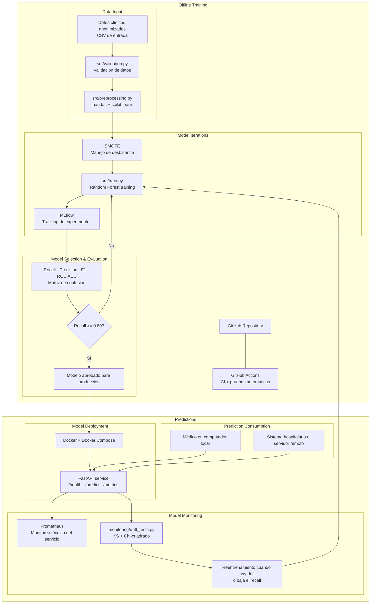

# MLOps Pipeline — Sistema de Predicción de Enfermedades

## Descripción general

Este proyecto propone un pipeline de MLOps end-to-end para construir, evaluar, desplegar, monitorear y mantener un modelo de machine learning capaz de apoyar al médico en la identificación de posibles enfermedades a partir de síntomas y datos clínicos básicos del paciente.

El sistema **no reemplaza el diagnóstico médico**. Su propósito es funcionar como una herramienta de apoyo a la decisión clínica, entregando una predicción y una probabilidad asociada para que el médico pueda priorizar, revisar o remitir el caso según su criterio profesional.

---

## Tabla de contenidos

1. [Definición del problema](#1-definición-del-problema)
2. [Arquitectura general del pipeline](#2-arquitectura-general-del-pipeline)
3. [Parte 1: Diseño del pipeline de machine learning](#parte-1-diseño-del-pipeline-de-machine-learning)
   - [3. GitHub y GitHub Actions](#3-github-y-github-actions)
   - [4. Data Input](#4-data-input)
   - [5. Data Validation](#5-data-validation)
   - [6. Data Preprocessing](#6-data-preprocessing)
   - [7. Model Iterations](#7-model-iterations)
   - [8. Model Selection y Evaluation](#8-model-selection-y-evaluation)
   - [9. Model Deployment](#9-model-deployment)
   - [10. Model Monitoring](#10-model-monitoring)
4. [Parte 2: Implementación](#parte-2-implementación)
5. [Parte 3: Requisitos futuros](#parte-3-requisitos-futuros)
6. [Estructura del repositorio](#estructura-del-repositorio)
7. [Cómo ejecutar el sistema](#cómo-ejecutar-el-sistema)
8. [CHANGELOG](#changelog)

---

## 1. Definición del problema

El problema se define como una tarea de **clasificación supervisada multiclase**. A partir de variables clínicas de entrada, el modelo predice una clase asociada al posible estado del paciente.

### Clases objetivo

```text
NO_ENFERMO
ENFERMEDAD_LEVE
ENFERMEDAD_AGUDA
ENFERMEDAD_CRONICA
```

La variable objetivo es `tipo_enfermedad`.

### Variables de entrada

```text
edad
sexo
temperatura
frecuencia_cardiaca
presion_sistolica
duracion_sintomas_dias
nivel_dolor
fiebre
tos
fatiga
perdida_peso
antecedentes_cronicos
```

### Dos escenarios contemplados

- **Enfermedades comunes:** modelo supervisado con suficiente volumen de datos históricos.
- **Enfermedades huérfanas:** bajo volumen de datos manejado mediante reglas clínicas, revisión experta, técnicas de manejo de desbalance y actualización progresiva del dataset.

> **Suposición general:** Para esta entrega, el sistema está diseñado y validado principalmente para el escenario de enfermedades comunes. El soporte a enfermedades huérfanas se declara como trabajo futuro y no está implementado en el código de esta versión.

---

## 2. Arquitectura general del pipeline



---

## Parte 1: Diseño del pipeline de machine learning

---

## 3. GitHub y GitHub Actions

### Tecnología elegida

**GitHub** como plataforma de versionamiento y **GitHub Actions** como herramienta de integración continua.

### Justificación

| Alternativa considerada | Razón de descarte |
|---|---|
| GitLab CI | Requiere infraestructura propia o cuenta GitLab; GitHub es más estándar en equipos académicos y tiene mejor ecosistema de Actions gratuitas |
| Jenkins | Requiere servidor dedicado, configuración compleja y mantenimiento de infraestructura adicional |
| CircleCI | Plan gratuito más limitado; integración con GitHub menos directa |

GitHub Actions se eligió porque se ejecuta directamente sobre el repositorio sin infraestructura adicional, tiene runners gratuitos para proyectos académicos y permite definir el pipeline de CI en YAML versionado junto al código.

### Contenido del repositorio

```text
- Código fuente (src/)
- Documentación (docs/)
- README.md y CHANGELOG.md
- Dockerfile y docker-compose.yml
- Scripts de validación, entrenamiento y monitoreo
- Pruebas automáticas (tests/)
- Datasets simulados o anonimizados de ejemplo (data/sample/)
```

> **Suposición:** Los datos clínicos reales no se almacenan en GitHub por razones de privacidad y tamaño. Se referencian mediante rutas locales configuradas en variables de entorno (`.env`).

### Estrategia de ramas

```text
main        → rama de producción protegida. Solo acepta merges desde develop.
develop     → rama de integración. Aquí se valida el pipeline completo.
feature/*   → ramas de trabajo por funcionalidad o experimento.
```

Los merges a `main` y `develop` requieren que el pipeline de CI pase correctamente. Si algún paso del CI falla, el merge queda bloqueado automáticamente mediante reglas de protección de rama en GitHub.

### Flujo de CI con GitHub Actions

El pipeline de CI se ejecuta automáticamente ante cualquier push o pull request hacia `develop` o `main`. Los pasos son:

```text
1. Checkout del repositorio.
2. Instalación de dependencias desde requirements.txt.
3. Ejecución de pruebas automáticas con Pytest (tests/).
4. Validación de estilo básico con flake8.
5. Verificación de que el servicio FastAPI puede iniciar correctamente.
6. Notificación del resultado en el pull request.
```

> **Suposición:** Si el CI falla en cualquiera de los pasos, el pipeline se detiene, el merge queda bloqueado y se genera una notificación en el pull request con el paso fallido y el log del error. No existe envío de alertas externas (email, Slack) en esta versión.

---

## 4. Data Input

### Tecnología elegida

Archivos **CSV** leídos con **pandas**.

### Justificación

CSV es el formato más común para datasets clínicos anonimizados en contextos académicos e institucionales. No requiere infraestructura adicional, es legible por humanos para auditoría y es compatible directamente con pandas y scikit-learn. Alternativas como bases de datos relacionales o formatos como Parquet son innecesarias para el volumen de datos de esta entrega.

### Estructura del dataset

Columnas esperadas:

```text
patient_id, edad, sexo, temperatura, frecuencia_cardiaca,
presion_sistolica, duracion_sintomas_dias, nivel_dolor,
fiebre, tos, fatiga, perdida_peso, antecedentes_cronicos,
diagnostico_confirmado, tipo_enfermedad
```

### Suposiciones de esta etapa

```text
1. Los datos usados en el repositorio son simulados o anonimizados.
2. Los datos reales no contienen nombres, documentos, teléfonos,
   direcciones ni correos electrónicos.
3. El diagnóstico confirmado fue definido por personal médico.
4. Los archivos de entrada tienen formato CSV con codificación UTF-8.
5. El dataset puede estar desbalanceado, especialmente para
   enfermedades huérfanas.
6. El campo patient_id es un identificador anónimo sin información
   personal identificable.
7. El tamaño del dataset de ejemplo es suficientemente pequeño para
   cargarse en memoria RAM sin particionamiento.
```

---

## 5. Data Validation

### Tecnología elegida

Scripts propios en **Python** implementados en `src/validation.py`.

### Justificación

| Alternativa considerada | Razón de descarte |
|---|---|
| Great Expectations | Introduce complejidad de configuración innecesaria para un dataset con esquema fijo y reglas clínicas específicas |
| Pandera | Más adecuado para validaciones de esquema puro; las reglas clínicas (rangos fisiológicos, ausencia de datos sensibles) son más expresivas en código Python explícito |

El problema médico requiere reglas clínicas explícitas y auditables. Un script en Python permite que cualquier profesional de salud pueda leer, entender y ajustar las reglas sin conocer frameworks externos.

### Reglas de validación implementadas

```text
1.  Existencia de todas las columnas obligatorias.
2.  Edad entre 0 y 120 años.
3.  Temperatura entre 34.0 y 43.0 grados Celsius.
4.  Duración de síntomas mayor o igual a 0 días.
5.  Nivel de dolor entre 0 y 10.
6.  Frecuencia cardíaca entre 30 y 250 lpm.
7.  Diagnóstico confirmado no vacío ni nulo.
8.  Clase objetivo perteneciente a los valores válidos definidos.
9.  Ausencia de filas duplicadas por patient_id.
10. Ausencia de columnas sensibles: nombre, cédula, teléfono,
    dirección, email.
11. Porcentaje de valores nulos menor o igual al 30% por columna.
```

### Comportamiento ante fallo

Si el dataset falla alguna validación crítica (reglas 1, 7, 8, 9, 10), el pipeline **se detiene completamente** y se genera un reporte de errores en:

```text
logs/validation_report.txt
```

El reporte incluye: regla fallida, columna afectada, número de registros problemáticos y descripción del error.

> **Suposición:** Las validaciones de rango (reglas 2, 3, 4, 5, 6) se tratan como advertencias si afectan a menos del 5% de los registros, y como error crítico si superan ese umbral. El umbral del 5% es configurable mediante variable de entorno `VALIDATION_ERROR_THRESHOLD`.

---

## 6. Data Preprocessing

### Tecnología elegida

**pandas** para manipulación de datos y **scikit-learn** (`Pipeline`, `ColumnTransformer`) para las transformaciones.

### Justificación

scikit-learn permite serializar el pipeline completo de preprocesamiento junto al modelo. Esto garantiza que exactamente las mismas transformaciones aplicadas durante el entrenamiento se apliquen también durante la predicción, eliminando el riesgo de inconsistencias entre etapas.

### Transformaciones definidas

| Transformación | Variables aplicadas | Justificación |
|---|---|---|
| Imputación con mediana | edad, temperatura, frecuencia_cardiaca, presion_sistolica, duracion_sintomas_dias, nivel_dolor | La mediana es robusta ante valores extremos clínicos (outliers fisiológicos). La media puede distorsionarse con un solo registro anómalo |
| Imputación con moda | sexo, fiebre, tos, fatiga, perdida_peso, antecedentes_cronicos | Variables binarias o categóricas: la moda preserva la categoría más frecuente sin inventar categorías intermedias |
| One-Hot Encoding | sexo | Única variable categórica no binaria del dataset |
| StandardScaler | Variables numéricas continuas | Estandarización a media 0 y desviación estándar 1. Se elige sobre MinMaxScaler porque es más robusto ante outliers clínicos extremos. Se elige sobre RobustScaler porque el dataset ya está validado y los outliers críticos fueron removidos en la etapa anterior |
| Separación train/test | Dataset completo | Proporción 80/20 con estratificación por `tipo_enfermedad` para preservar la distribución de clases en ambos conjuntos |

### Suposiciones de esta etapa

```text
1. El pipeline de scikit-learn serializado incluye el preprocesador
   completo. Al cargar el modelo en producción, las transformaciones
   se aplican automáticamente sin reentrenar el scaler.
2. No existen variables categóricas con alta cardinalidad que generen
   explosión de dimensiones con One-Hot Encoding.
3. No se usa conjunto de validación separado (train/val/test) en esta
   versión. La evaluación se hace sobre el conjunto de test del split
   80/20. Para versiones futuras con búsqueda de hiperparámetros se
   recomienda agregar validación cruzada.
4. SMOTE se aplica únicamente sobre el conjunto de entrenamiento,
   después del split, para evitar data leakage hacia el conjunto de
   test. El orden estricto es: split → SMOTE en train → entrenamiento.
```

El preprocesamiento se implementa en `src/preprocessing.py`.

---

## 7. Model Iterations

### Tecnologías elegidas

**Random Forest Classifier** (scikit-learn), **SMOTE** (imbalanced-learn) y **MLflow** para tracking de experimentos.

### Justificación del modelo

| Criterio | Justificación |
|---|---|
| Datos tabulares | Random Forest está optimizado para datos estructurados en columnas |
| Relaciones no lineales | Captura interacciones complejas entre síntomas sin requerir ingeniería de features manual |
| Interpretabilidad | `feature_importances_` permite explicar al médico qué variables influyen más en la predicción |
| Desbalance de clases | Soporta el parámetro `class_weight='balanced'` como complemento a SMOTE |
| Baseline sólido | Es el modelo de referencia estándar en problemas clínicos tabulares antes de explorar modelos más complejos |

Alternativa considerada: **XGBoost**. Se descarta para esta entrega porque requiere más ajuste de hiperparámetros, es menos interpretable para médicos no técnicos y el beneficio de desempeño no está justificado sin evidencia previa de que Random Forest sea insuficiente.

### Justificación de SMOTE

SMOTE (Synthetic Minority Oversampling Technique) genera muestras sintéticas de las clases minoritarias interpolando entre muestras reales existentes. Se elige sobre:

- **Undersampling:** descarta datos reales de la clase mayoritaria, lo que en datasets médicos pequeños puede eliminar información valiosa.
- **class_weight únicamente:** SMOTE complementa el ajuste de pesos porque actúa sobre los datos antes del entrenamiento, dando al modelo más ejemplos reales de clases difíciles.

### Justificación de MLflow

| Alternativa considerada | Razón de descarte |
|---|---|
| Weights & Biases | Requiere cuenta en servicio externo; datos clínicos no deben salir del entorno controlado |
| DVC | Enfocado en versionamiento de datos, no en tracking de experimentos de modelo |
| Neptune.ai | Servicio de pago para equipos; innecesario para esta escala |

MLflow se ejecuta localmente en un contenedor Docker dentro del mismo `docker-compose.yml`. La UI de MLflow queda disponible en `http://localhost:5000` para que el equipo revise experimentos durante el desarrollo.

### Qué registra MLflow por experimento

```text
- Fecha y hora del experimento
- Versión del código (hash del commit de GitHub)
- Hiperparámetros del modelo: n_estimators, max_depth,
  min_samples_split, class_weight, random_state
- Métricas: recall, precision, f1-score, accuracy, ROC AUC
- Matriz de confusión como artefacto PNG
- Pipeline serializado completo (preprocesador + modelo) como artefacto .pkl
```

### Hiperparámetros iniciales

```text
n_estimators:      100
max_depth:         None (sin límite)
min_samples_split: 2
class_weight:      balanced
random_state:      42
```

> **Suposición:** No se realiza búsqueda automática de hiperparámetros (GridSearch, RandomSearch) en esta versión. Los hiperparámetros iniciales son los valores por defecto de scikit-learn con `class_weight='balanced'`. En versiones futuras se puede agregar búsqueda con validación cruzada estratificada.

El entrenamiento se implementa en `src/train.py`.

---

## 8. Model Selection y Evaluation

### Métricas de evaluación

```text
- Recall (métrica principal)
- Precision
- F1-score
- Accuracy
- ROC AUC (macro promedio para multiclase)
- Matriz de confusión
```

### Justificación del umbral de recall

La métrica principal es **recall** porque en el contexto clínico un **falso negativo** (predecir NO_ENFERMO cuando el paciente está enfermo) tiene consecuencias más graves que un falso positivo (generar una alerta preventiva innecesaria). Un falso negativo puede retrasar el diagnóstico y el tratamiento de un paciente que sí lo necesita.

El umbral mínimo definido es **recall ≥ 0.80**, lo que significa que el modelo debe identificar correctamente al menos el 80% de los pacientes enfermos en el conjunto de test.

### Criterios de aprobación del modelo

```text
1. Recall igual o superior a 0.80 en el conjunto de test.
2. Sin errores críticos en la etapa de validación de datos.
3. Tiempo de inferencia menor a 1 segundo por paciente en ejecución local
   (medido con el pipeline serializado cargado en memoria).
4. Modelo y métricas registrados correctamente en MLflow.
5. Pruebas automáticas de Pytest ejecutadas sin fallos.
6. Documentación actualizada en README.md y CHANGELOG.md.
```

### Proceso de aprobación

La aprobación del modelo **no es automática**. El equipo de ML revisa las métricas en la UI de MLflow (`http://localhost:5000`) y valida que el modelo sea clínicamente aceptable. La aprobación manual se registra en MLflow marcando el experimento aprobado con el tag `status=approved` y la versión de producción con `stage=Production`.

Si el modelo no cumple los criterios, vuelve a la etapa de iteración del modelo con ajuste de hiperparámetros o datos adicionales.

---

## 9. Model Deployment

### Tecnologías elegidas

**FastAPI** para el servicio REST, **Docker** para el empaquetamiento y **Docker Compose** para la orquestación local.

### Justificación de FastAPI

| Alternativa considerada | Razón de descarte |
|---|---|
| Flask | Más verboso, sin validación automática de tipos, sin documentación automática de endpoints |
| Django REST Framework | Excesivo para un microservicio de predicción; agrega overhead de ORM y configuración innecesaria |
| Streamlit | Orientado a interfaces de usuario, no a APIs REST consumibles por sistemas hospitalarios |

FastAPI genera automáticamente documentación interactiva (Swagger UI) en `/docs`, valida los datos de entrada mediante Pydantic y tiene rendimiento comparable a frameworks asíncronos de Node.js.

### Justificación de Docker

| Alternativa considerada | Razón de descarte |
|---|---|
| Entorno virtual (venv/conda) | No garantiza reproducibilidad entre sistemas operativos distintos ni entre versiones de Python |
| Ejecutable empaquetado (PyInstaller) | Difícil de mantener, actualizar y escalar; no estándar en despliegues de ML |

Docker garantiza que el entorno de ejecución es idéntico en el computador del médico, en el servidor del hospital y en el entorno de desarrollo del equipo.

### Cómo se carga el modelo en el contenedor

El modelo entrenado (pipeline serializado `.pkl`) se copia al contenedor durante el build mediante `COPY` en el Dockerfile:

```dockerfile
COPY models/model_production.pkl /app/models/model_production.pkl
```

La ruta del modelo se configura mediante la variable de entorno `MODEL_PATH`. Al iniciar el contenedor, `src/model_loader.py` carga el pipeline en memoria. Si el archivo no existe, la API lanza un error explícito al inicio y no levanta el servicio.

> **Suposición:** El modelo cabe en la memoria RAM disponible del servidor donde corre Docker. Para Random Forest con el dataset de ejemplo, el modelo serializado ocupa menos de 50 MB. Si en versiones futuras el modelo crece significativamente, se evaluará descarga desde MLflow al iniciar el contenedor.

### Endpoints de la API

| Endpoint | Método | Descripción |
|---|---|---|
| `/health` | GET | Verifica que el servicio está activo y el modelo cargado |
| `/predict` | POST | Recibe datos clínicos y devuelve predicción y probabilidad |
| `/metrics` | GET | Expone métricas técnicas en formato Prometheus |

### Configuración del servidor

```text
- Framework: FastAPI con Uvicorn
- Workers: 1 worker (proceso único) en esta versión
- Puerto: 8000
- Autenticación: ninguna en esta versión
```

> **Suposición:** Los endpoints son públicos sin autenticación. En un despliegue real con datos clínicos reales se requeriría autenticación con tokens JWT o API keys. Esta versión asume un entorno controlado (red local del hospital o VPN).

### Persistencia de predicciones

Cada solicitud al endpoint `/predict` se registra automáticamente en una base de datos SQLite local:

```text
data/predictions_log.db
```

Cada registro incluye: timestamp, variables de entrada, clase predicha, probabilidad y versión del modelo. Esta persistencia es la que alimenta el drift monitoring.

### Escenario local

```bash
docker-compose up --build
```

Servicios disponibles:

```text
http://localhost:8000       → API de predicción
http://localhost:8000/docs  → Documentación interactiva (Swagger UI)
http://localhost:5000       → UI de MLflow
http://localhost:9090       → UI de Prometheus
```

### Escenario remoto

El servicio se despliega en un servidor Linux con Docker Compose. El flujo de una predicción remota es:

```text
Sistema hospitalario o médico remoto
        ↓
Petición HTTP POST a /predict
        ↓
FastAPI carga el modelo desde memoria (ya cargado al inicio)
        ↓
Validación de entrada con Pydantic
        ↓
Predicción con el pipeline serializado
        ↓
Log del resultado en SQLite
        ↓
Respuesta JSON al cliente
```

Ejemplo de entrada:

```json
{
  "edad": 45,
  "sexo": "F",
  "temperatura": 38.5,
  "frecuencia_cardiaca": 95,
  "presion_sistolica": 120,
  "duracion_sintomas_dias": 3,
  "nivel_dolor": 7,
  "fiebre": true,
  "tos": true,
  "fatiga": true,
  "perdida_peso": false,
  "antecedentes_cronicos": false
}
```

Ejemplo de salida:

```json
{
  "predicted_class": "ENFERMEDAD_AGUDA",
  "probability": 0.82,
  "model_version": "v1.0.0",
  "message": "Resultado generado correctamente. No reemplaza el criterio médico."
}
```

---

## 10. Model Monitoring

### 10.1 Monitoreo técnico con Prometheus

### Tecnología elegida

**Prometheus** para recolección de métricas técnicas.

### Justificación

| Alternativa considerada | Razón de descarte |
|---|---|
| Grafana Cloud | Requiere cuenta externa; datos del servicio no deben salir del entorno controlado |
| Datadog | Servicio de pago; excesivo para esta escala |
| Logs en archivos planos | No permite consultas temporales, alertas ni visualización sin herramientas adicionales |

Prometheus se ejecuta como contenedor adicional en el mismo `docker-compose.yml` sin infraestructura externa. Es el estándar de facto para monitoreo de microservicios en contenedores.

### Métricas expuestas

```text
predict_requests_total          → Número total de solicitudes en /predict
predict_request_latency_seconds → Tiempo de respuesta de /predict
predict_errors_total            → Número total de errores durante predicción
predictions_by_class_total      → Cantidad de predicciones por clase
model_version_info              → Versión del modelo desplegado
```

### Reglas de alerta definidas

```text
1. Si /health no responde en 30 segundos → revisar estado del contenedor.
2. Si latencia promedio supera 2 segundos → revisar modelo o infraestructura.
3. Si errores superan el 5% de las peticiones → revisar logs antes de continuar.
4. Si una clase concentra más del 80% de las predicciones → cruzar con drift.
```

> **Suposición:** Las alertas son visibles en la UI de Prometheus (`http://localhost:9090`). En esta versión no hay envío de notificaciones externas (email, Slack, PagerDuty). En un entorno de producción real se agregaría Alertmanager.

---

### 10.2 Monitoreo de drift con Python

### Tecnología elegida

Scripts propios en **Python** usando `scipy.stats` en `monitoring/drift_tests.py`.

### Justificación

| Alternativa considerada | Razón de descarte |
|---|---|
| Evidently AI | Introduce dependencia externa innecesaria; las pruebas estadísticas requeridas (KS, Chi-cuadrado) están disponibles directamente en scipy sin frameworks adicionales |
| WhyLogs | Mismo argumento; añade complejidad de configuración para un conjunto acotado de variables |

### Fuente de datos para el monitoreo

El script compara dos datasets:

```text
Dataset de referencia → datos usados para entrenar el modelo
                        (guardado como CSV al finalizar el entrenamiento)
Dataset actual        → predicciones recientes leídas desde predictions_log.db
                        (generado por el logging automático del endpoint /predict)
```

> **Suposición:** El script de drift requiere un mínimo de 30 registros en el dataset actual para que las pruebas estadísticas sean válidas. Con menos registros, el script genera una advertencia y no ejecuta las pruebas.

### Pruebas estadísticas

Para variables numéricas — **Kolmogorov-Smirnov**:

```text
edad, temperatura, frecuencia_cardiaca, presion_sistolica,
duracion_sintomas_dias, nivel_dolor
```

Para variables categóricas — **Chi-cuadrado**:

```text
sexo, fiebre, tos, fatiga, perdida_peso,
antecedentes_cronicos, tipo_enfermedad_predicha
```

### Criterio de drift

```text
Si p-value < 0.05 → existe drift estadísticamente significativo en esa variable
```

### Frecuencia de ejecución

El script se ejecuta **manualmente** por el equipo de ML con la siguiente periodicidad recomendada:

```text
- Cada semana durante el primer mes de despliegue.
- Cada dos semanas a partir del segundo mes.
- Inmediatamente si Prometheus detecta una concentración anómala de predicciones en una sola clase.
```

> **Suposición:** En esta versión no existe scheduler automático (cron job, Airflow, Lambda). La ejecución manual es suficiente para el volumen esperado de predicciones en esta entrega académica.

### Acción ante drift detectado

```text
1. El script genera un reporte en logs/drift_report.txt con las variables afectadas.
2. El equipo de ML revisa el reporte y evalúa si el drift es clínicamente relevante.
3. Si el drift afecta variables críticas (temperatura, fiebre, tipo_enfermedad_predicha),
   se inicia el proceso de reentrenamiento con datos actualizados.
4. Si el recall baja por debajo de 0.80, el reentrenamiento es obligatorio.
```

---

## Parte 2: Implementación

### Componente implementado

Para esta entrega se implementa el **servicio de predicción**, que representa la etapa de despliegue del modelo. Este componente incluye:

```text
- API con FastAPI y validación de entradas con Pydantic
- Endpoint /predict con logging automático a SQLite
- Endpoint /health
- Endpoint /metrics para Prometheus
- Dockerfile y docker-compose.yml
- Configuración de Prometheus (monitoring/prometheus.yml)
- Scripts base de validación (src/validation.py)
- Scripts base de drift (monitoring/drift_tests.py)
```

### Suposiciones de la implementación

```text
1.  El dataset incluido es simulado o anonimizado.
2.  El modelo no reemplaza el diagnóstico médico.
3.  El médico usa el resultado como apoyo a su criterio profesional.
4.  El modelo principal es Random Forest Classifier serializado con scikit-learn.
5.  El pipeline serializado incluye el preprocesador completo.
6.  Los datos reales no se almacenan en GitHub.
7.  El despliegue local se hace con Docker Compose.
8.  El monitoreo técnico se hace con Prometheus.
9.  El monitoreo de drift se hace con pruebas estadísticas en Python con scipy.
10. La validación del dataset se hace con scripts propios en Python.
11. Los endpoints no tienen autenticación en esta versión académica.
12. El servidor tiene suficiente RAM para cargar el modelo en memoria.
```

---

## Parte 3: Requisitos futuros

### Predicciones en tiempo real

La solución actual ya soporta predicciones en tiempo real mediante FastAPI con tiempos de respuesta inferiores a 1 segundo. Si el volumen de usuarios aumenta, se pueden agregar:

```text
- Múltiples workers de Uvicorn (configurar workers > 1 en docker-compose.yml)
- Balanceador de carga (nginx) delante de la API
- Escalamiento horizontal con múltiples réplicas del contenedor
```

### Reentrenamiento periódico con diagnósticos confirmados

El reentrenamiento se activará cuando se cumpla alguna de estas condiciones:

```text
1. Llegan nuevos diagnósticos confirmados por personal médico.
2. Se detecta drift estadísticamente significativo en variables clínicas críticas.
3. El recall baja por debajo de 0.80 en producción.
4. Se incorporan nuevas enfermedades al dataset.
5. Aumenta la cantidad de casos de enfermedades huérfanas disponibles.
```

El nuevo modelo se compara contra el modelo en producción en MLflow. Solo reemplaza al anterior si mejora o mantiene el recall mínimo de 0.80.

### Versionamiento de múltiples modelos

Las versiones del modelo se gestionan con:

```text
- Tags de GitHub para versiones del proyecto (v1.0.0, v1.1.0...)
- MLflow Tracking para registro de experimentos y artefactos
- MLflow Model Registry para gestión de stages (Staging, Production, Archived)
- Campo model_version en la respuesta de la API
- Variable de entorno MODEL_VERSION para seleccionar qué versión cargar
```

Ejemplo de historial de versiones:

```text
v1.0.0 → Modelo inicial Random Forest con dataset simulado
v1.1.0 → Reentrenado con nuevos diagnósticos confirmados
v1.2.0 → Actualizado con reglas clínicas para enfermedades huérfanas
```

---

## Estructura del repositorio

```text
Microservicio-Prediccion-Enfermedad/
│
├── README.md
├── CHANGELOG.md
├── Dockerfile
├── docker-compose.yml
├── requirements.txt
├── .env.example
│
├── data/
│   ├── sample/
│   │   └── pacientes.csv
│   └── predictions_log.db          ← generado automáticamente en ejecución
│
├── models/
│   └── model_production.pkl        ← pipeline serializado (preprocesador + modelo)
│
├── src/
│   ├── main.py                     ← entrypoint de FastAPI
│   ├── validation.py               ← validación de datos de entrada
│   ├── preprocessing.py            ← pipeline de preprocesamiento
│   ├── train.py                    ← entrenamiento del modelo
│   ├── predict.py                  ← lógica de predicción
│   └── model_loader.py             ← carga del pipeline serializado al iniciar
│
├── monitoring/
│   ├── drift_tests.py              ← pruebas KS y Chi-cuadrado
│   ├── prometheus.yml              ← configuración de Prometheus
│   └── monitoring_plan.md
│
├── tests/
│   ├── test_validation.py
│   └── test_prediction.py
│
├── logs/                           ← generado automáticamente en ejecución
│   ├── validation_report.txt
│   └── drift_report.txt
│
└── docs/
    ├── pipeline_mlops.md
    ├── supuestos_y_restricciones.md
    ├── tecnologias.md
    └── diagrama_pipeline.svg
```

---

## Cómo ejecutar el sistema

### Requisitos previos

```text
- Docker Desktop instalado y en ejecución
- Docker Compose v2 o superior
- Git
```

### Pasos

```bash
# 1. Clonar el repositorio
git clone <url-del-repositorio>
cd Microservicio-Prediccion-Enfermedad

# 2. Copiar variables de entorno
cp .env.example .env

# 3. Levantar todos los servicios
docker-compose up --build
```

### Servicios disponibles

```text
http://localhost:8000       → API de predicción
http://localhost:8000/docs  → Documentación interactiva Swagger UI
http://localhost:8000/health → Estado del servicio
http://localhost:8000/metrics → Métricas para Prometheus
http://localhost:5000       → UI de MLflow
http://localhost:9090       → UI de Prometheus
```

### Ejemplo de predicción

```bash
curl -X POST http://localhost:8000/predict \
  -H "Content-Type: application/json" \
  -d '{
    "edad": 45,
    "sexo": "F",
    "temperatura": 38.5,
    "frecuencia_cardiaca": 95,
    "presion_sistolica": 120,
    "duracion_sintomas_dias": 3,
    "nivel_dolor": 7,
    "fiebre": true,
    "tos": true,
    "fatiga": true,
    "perdida_peso": false,
    "antecedentes_cronicos": false
  }'
```

### Ejecutar pruebas

```bash
docker-compose run api pytest tests/ -v
```

### Ejecutar validación de datos manualmente

```bash
docker-compose run api python src/validation.py --input data/sample/pacientes.csv
```

### Ejecutar monitoreo de drift manualmente

```bash
docker-compose run api python monitoring/drift_tests.py
```

---

## CHANGELOG

Los cambios entre versiones se documentan en `CHANGELOG.md` siguiendo el formato [Keep a Changelog](https://keepachangelog.com/es/1.0.0/).


